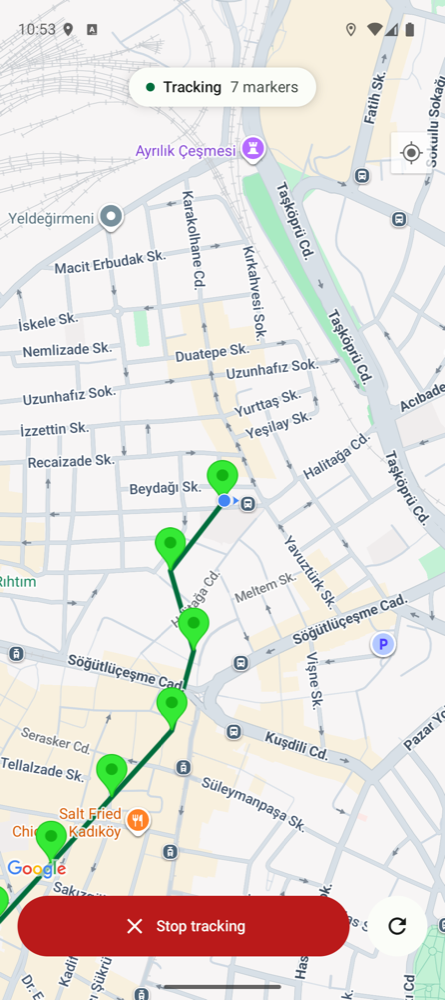
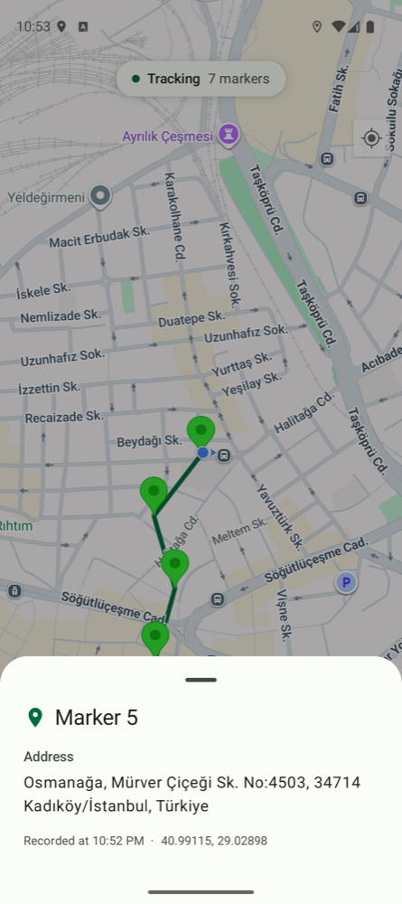
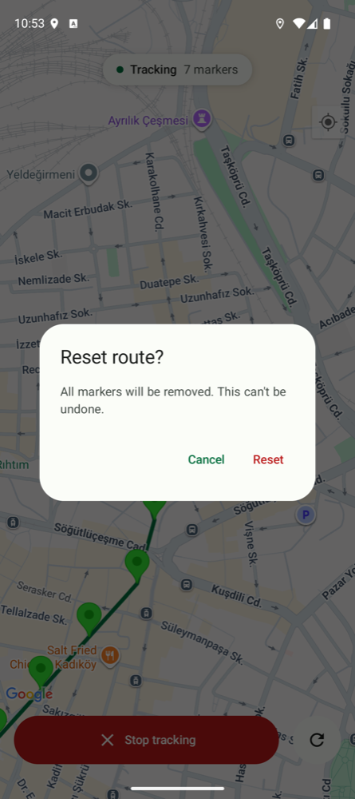

# MartiCase

Android case study for Martı. The app tracks the user's location, drops a marker on the map for every
100 m of movement, keeps tracking in the background, and shows the address of a marker when it's tapped.
The brief is summarized as R1–R9 below.

<p>
  
  
  
</p>

## Requirements from the brief

| # | Requirement | How |
|---|---|---|
| R1 | Marker every 100 m | `RecordLocationUseCase`: distance from the **last marker**, fixes worse than 50 m accuracy ignored ([ADR 0005](docs/adr/0005-marker-distance-rule.md)) |
| R2 | Track in foreground and background as long as possible | Location foreground service, `START_STICKY`, battery optimization exemption, resumes on app open ([ADR 0004](docs/adr/0004-background-tracking-strategy.md)) |
| R3 | Tap a marker to see its address | Bottom sheet; platform `Geocoder`, cached in Room after the first lookup |
| R4 | Start / stop tracking | Button on the map and a Stop action in the notification |
| R5 | Reset route; otherwise show it again on reopen | Points in Room, tracking flag in DataStore ([ADR 0006](docs/adr/0006-route-persistence.md)); reset asks for confirmation |
| R6 | Any map provider | Google Maps Compose ([ADR 0002](docs/adr/0002-map-provider-google-maps-compose.md)) |
| R7 | Git, GitHub repo | Small conventional commits, CI on every push |
| R8 | Design is free | Full screen map, status chip, one primary action, Material 3 with own tokens, light/dark, EN/TR |
| R9 | Commit AI helper files | [`CLAUDE.md`](CLAUDE.md), [`.claude/`](.claude), [`docs/adr/`](docs/adr) — see below |

## Build

Needs the latest stable Android Studio and JDK 17.

Add a Google Maps API key (Maps SDK for Android) to `local.properties`:

```properties
MAPS_API_KEY=your_key_here
```

The key can also come from the `MAPS_API_KEY` environment variable. Without a key the app still builds,
tracks and stores the route, but the map tiles stay blank.

```bash
./gradlew assembleDebug
```

## Stack

| | |
|---|---|
| Language | Kotlin |
| UI | Jetpack Compose, Material 3, Google Maps Compose |
| Architecture | MVVM, use cases, multi-module |
| Async | Coroutines, Flow |
| DI | Hilt (KSP) |
| Location | Fused Location Provider, foreground service (`location` type) |
| Storage | Room (route), DataStore (tracking flag) |
| Tests | JUnit 4, MockK, Turbine, Truth |
| Code quality | Detekt (+ Compose rules), Spotless (ktlint), Android Lint, GitHub Actions |

## Modules

```
:app                            Application, MainActivity, coroutine DI
:core:common                    dispatcher and app scope qualifiers
:core:designsystem              MartiCaseTheme tokens, Marti* components
:core:database                  Room: route_points
:core:datastore                 tracking flag
:core:testing                   MainDispatcherRule
:feature:tracking:domain        models, repository interfaces, use cases (pure Kotlin)
:feature:tracking:data          repositories, fused location, geocoder, TrackingService
:feature:tracking:presentation  map screen, ViewModel, permission flow
```

Shared Gradle setup lives in `build-logic` as `marticase.*` convention plugins; versions are in
`gradle/libs.versions.toml`. Module rules (e.g. presentation can't see data) are enforced with
`moduleGraphAssert`, and detekt forbids raw Material/`dp`/`Color` use outside the design system.

## How tracking works

1. **Start** runs the steps the service needs, in order: precise location → notifications (13+) →
   battery optimization exemption → device location on. Then the service is started from visible UI.
2. `TrackingService` collects fused location updates (high accuracy, ~10 s, 20 m min distance) and
   passes each fix to `RecordLocationUseCase`. Stale (> 30 s) and unknown-accuracy fixes are dropped.
3. A marker is saved when the fix is ≥ 100 m from the last marker. The map observes the Room table, so
   markers appear live, connected by a polyline.
4. **Stop** (button or notification) clears the flag and stops the service. **Reset** deletes the points.
5. If the system kills the process, `START_STICKY` tries to restart the service. Android 12+/14+ may block
   a background restart of a location service; then the flag stays on and tracking resumes the next time
   the app is opened.

## Tests

```bash
./gradlew testDebugUnitTest :feature:tracking:domain:test
./gradlew connectedDebugAndroidTest     # DAO test, needs a device
./gradlew spotlessCheck detekt lintDebug
```

- Domain: the 100 m rule (first fix, < 100 m, ≥ 100 m, distance from last marker not last fix, accuracy limit), haversine distance, address caching.
- Data: route, address and tracking repositories (start failure keeps the flag off).
- Presentation: `TrackingViewModel` (restore, start/stop, start failure, address states, reset, resume).
- Manually checked on an Android 16 emulator with simulated GPS: permission chain, marker tap shows the
  geocoded address, reset, Stop from the notification.

### Background behavior (Android 16 emulator)

Simulated walk of ~120 m steps with `adb emu geo fix`; markers counted straight from the Room database.

| Scenario | How | Result |
|---|---|---|
| App in background | Home button | 3 steps → 3 markers |
| Screen off + Doze | `dumpsys deviceidle force-idle` | 3 → 3, service stays foreground |
| Doze without battery exemption | exemption removed, then Doze | 3 → 3 (location FGS isn't throttled by Doze) |
| Removed from recents | swipe the task away | activity gone, service keeps running, 3 → 3 |
| Process killed by the system | `kill -9` on the app process | service restarted by `START_STICKY` in ~1 s, 3 → 3, no crash |
| Same, without battery exemption | exemption removed, `kill -9` | restarted, 3 → 3 |
| Force stop by the user | `am force-stop` | stops (Android rule); reopening the app resumes tracking, 2 → 2 |

The ongoing notification ("Tracking your route", with Stop) stays visible throughout. OEM battery managers
can be stricter than stock Android; the battery exemption asked at start is there for those devices.

## How AI was used

The project was built with Claude Code. The brief allowed AI as long as the helper files are in the repo, so
everything that shaped the AI's work is committed:

- **[`CLAUDE.md`](CLAUDE.md)** — the brief as requirements R1–R9, the architecture rules and the workflow.
  It's loaded into every session, so context is given once instead of in every prompt.
- **[`.claude/agents/`](.claude/agents)** — four agents with separate roles and tool access:
  - `android-architect` (read-only) lays out options with trade-offs for each decision;
  - `android-implementer` writes one scoped step and can't make architecture choices;
  - `android-verifier` (read-only) builds, tests, checks the rules and returns PASS/FAIL — a FAIL blocks the commit;
  - `location-reviewer` (read-only) reviews location/service code for real-device behavior.
- **[`.claude/skills/`](.claude/skills)** — `adr` (record a decision), `ship` (commit + push one verified
  step), `feature-module` (scaffold a module with the right convention plugins).
- **[`docs/adr/`](docs/adr)** — every architectural decision was offered as options and picked by me;
  each ADR lists the options that were on the table and why one was chosen.

The loop for every step: decide (architect → me) → record (ADR) → build → verify → commit.
Two examples where the agents changed the code: the verifier failed the first build-logic step on lint
errors; the location reviewer found two crash paths in the foreground service (background FGS start
on Android 12/14+, and stopping before `startForeground`) before they were committed — the fixes and the
resulting limitations are recorded in ADR 0004.

## Known limitations

- Tracking does not restart after a device reboot until the app is opened (ADR 0004).
- On Android 14+ the ongoing notification can be swiped away; the service keeps running.
- Address lookup needs network and a device `Geocoder`; when it fails the sheet says so.
- One route at a time, no history or export.
